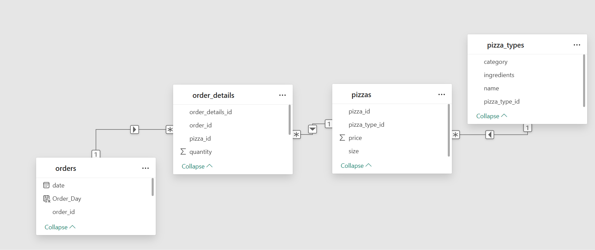
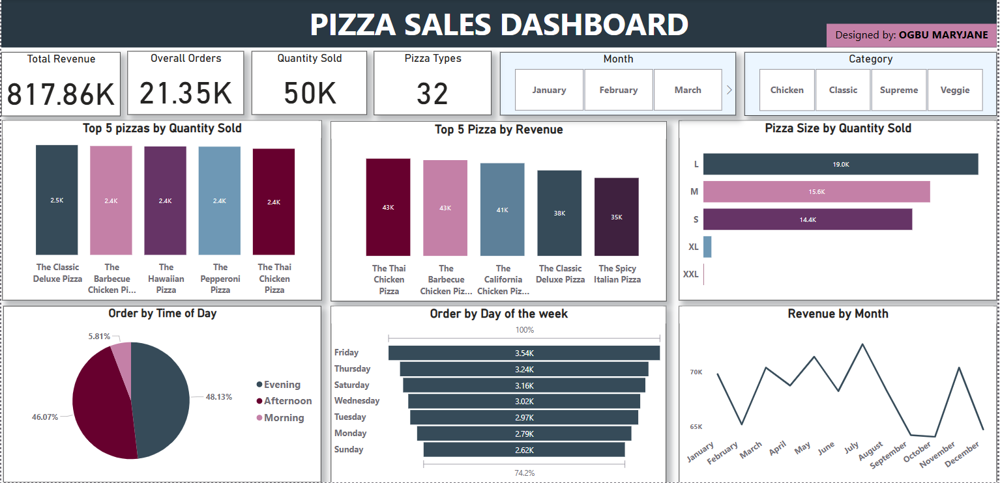
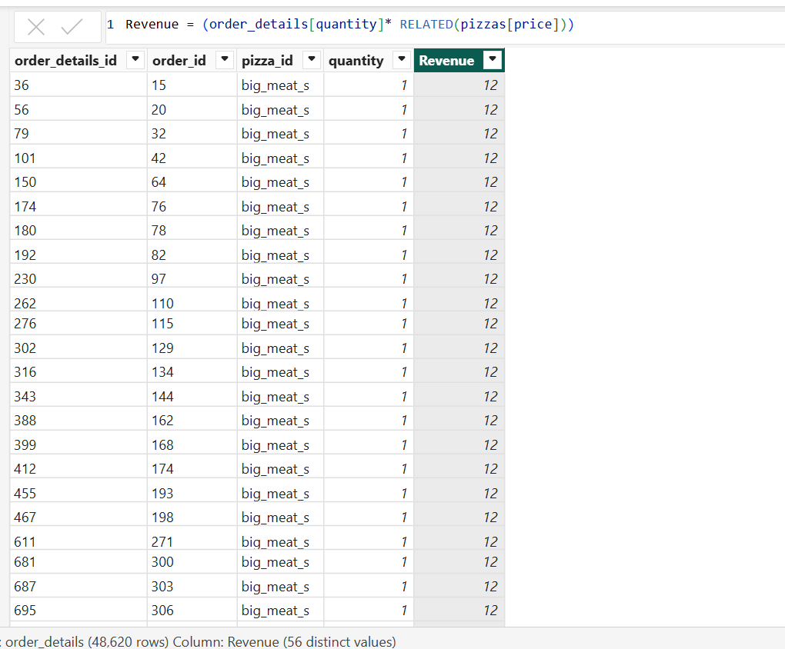
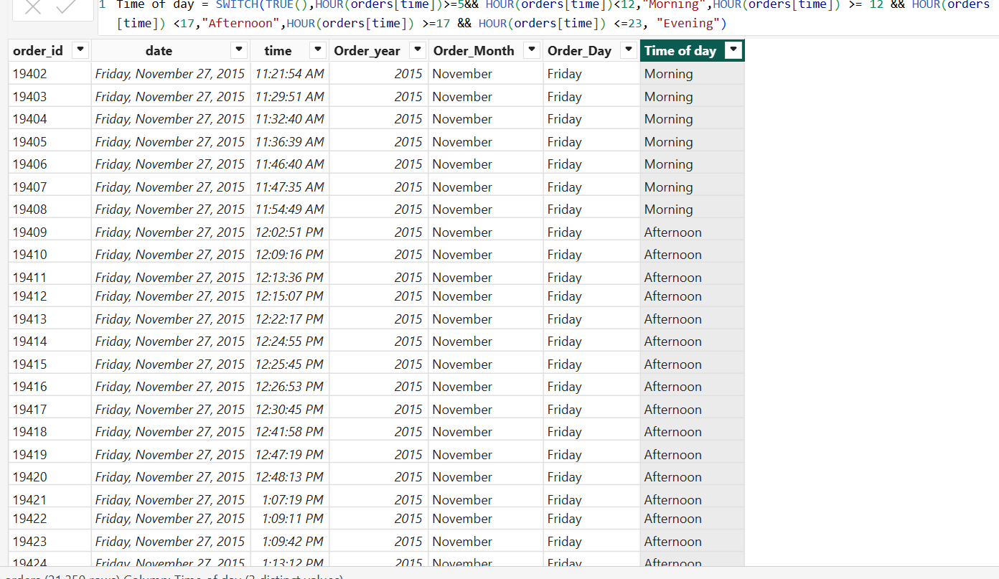
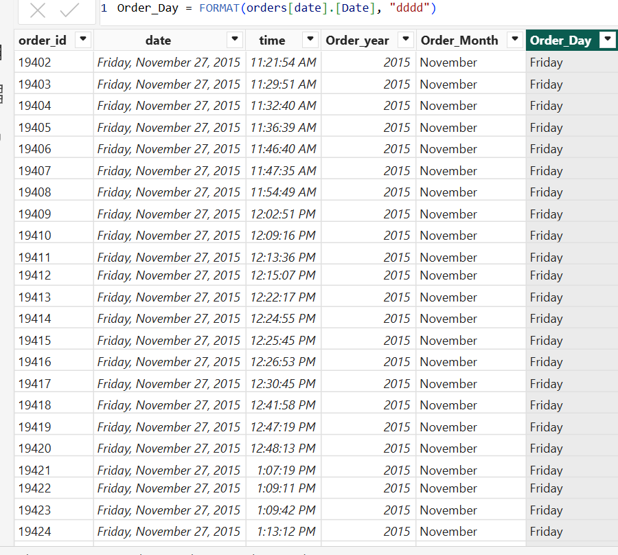

# *Pizza Sales Analysis Project*

---
## Project overview:

The objective of the project was to transform raw transactional data into meaningful business insights through data cleaning, modeling, DAX calculations, and interactive visualizations. The final dashboard presents key metrics and trends to support data-driven decision-making in a retail food business context.

**_Disclaimer_**: All datasets and reports do not reperesent any company, institution or country, but just a dummy dataset to demonstrate capabilities of power BI

## Data Sources:

This project uses four CSV files that contain information about pizza orders:

- orders.csv – This file lists each order, including the order ID and the date and time it was placed.

- order_details.csv – This file breaks down each order, showing which pizzas were ordered  and how many.

- pizza_types.csv – This file describes each type of pizza, including the name, category (like classic or veggie), and ingredients.

 - pizzas.csv- This file includes prices and pizza sizes. 

## Problem Statement:

1. Which day of the week receives the highest number of orders, and which days are the least busy?

2. What time of day sees the most pizza orders?

3. Which pizza size is ordered the most?

4. Which pizza type is the most frequently ordered?

5. Which pizza type brings in the highest revenue?

6. Which month generates the highest revenue?

## Key Skills Demonstrated:

- Power Query: Data cleaning and transformation

- Data Modeling: Star schema and relationship management

- DAX: Calculated columns and measures ( Revenue, DayOfWeek, TimeOfDay)

- Power BI: Interactive dashboards, slicers and charts

## Modelling:

The data was modeled in a star schema format:

Fact Table: order_details

Dimension Tables: orders, pizzas, pizza_types

## Visualization:

The Power BI dashboard was designed to be clear, interactive, and insightful. Key visuals include:

- Cards: Displayed total orders, revenue,quantity of pizza sold and the number of pizza types available.

- Bar Chart: Showed pizza size by quantity sold to determine which pizza size was ordered the most

- Pie Chart: Illustrated the distribution of pizza order by time of day (Morning, Afternoon, Evening, Night), highlighting the time of day that was busiest.

- Column Chart: Showed the top 5 pizza by quantity sold and the top 5 pizza by Revenue generated.

- Funnel Chart: Ranked pizza orders by day of the week 

- Line Chart: Tracked monthly revenue trends to spot peak and low-performing periods.

### Slicers for Interactivity
     Pizza Category Slicer: Allows users to filter insights based on pizza categories (e.g., Chicken, Classic, Supreme, Veggie).

     Month Slicer: Enables selection of specific months to explore trends and performance over time.

You can interact with the report [here](Pizza_Sales_Dashboard.pbix)

## Analysis:

The analysis was carried out using Power BI and focused on answering specific business questions related to order patterns, customer preferences, and revenue trends.

 **Data Cleaning & Preparation**
 
- Removed duplicates and missing values

- Corrected inconsistent data types

- Created new columns like:

   1.Revenue (calculated as quantity × price)

   2.Time of Day (Morning, Afternoon, Evening)

   3.Day of the Week (Monday to Sunday)

###       Revenue                           
          

###    Time of day
                      
   
###     Order day 
                           

**Data Exploration**

- Used line graphs to explore trends over time

- Created calculated measures using DAX to summarize total orders, revenue, quantity sold and number of pizza types

  ## Key Findings:
  
- **Friday** had the most orders (3,538), while **Sunday** and **Monday** were the slowest days of the week

- **Evening** was the busiest time of day, accounting for 48.13% of all orders

- **Large pizzas** were the most popular, with 18,956 orders

- **Classic deluxe pizza** had the highest number of orders (2,453), but **Thai chicken pizza** brought in the most revenue

- **July** was the peak month in terms of revenue (72,557)

  ##  Recommendation:
  
- Offer promos on Sundays and Mondays to boost sales

- Introduce bundle deals for large-sized pizzas

- Run Friday campaigns and prepare for peak months like July

